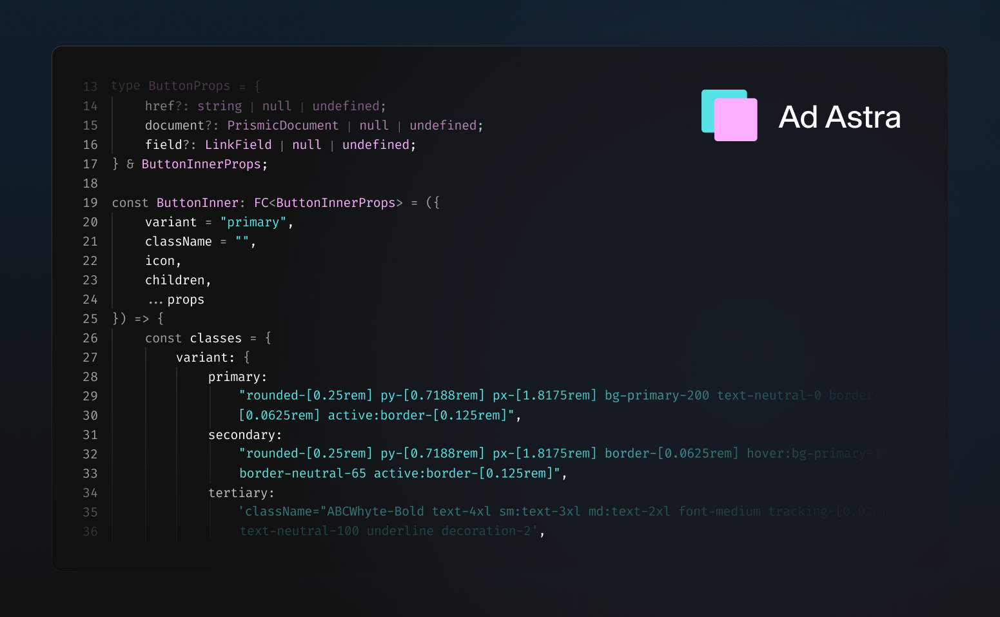

# 🌌 Ad Astra Theme for Zed


Ad Astra's space-inspired design not only helps you focus on your work and increase productivity but adds a touch of personality and style to your workspace.

The carefully selected contrasting blue and lavender colors improve readability and make your code stand out. The extension includes both:

- Ad Astra Dark
- Ad Astra Light

Both variants keep a similar palette, while the light mode is tuned for stronger contrast and readability on bright backgrounds.



## Installation

### From Zed Extensions (Recommended)

1. Open Zed
2. Press `cmd+shift+p` (macOS) or `ctrl+shift+p` (Linux/Windows)
3. Type "extensions" and select **Extensions: Install Extensions**
4. Search for "Ad Astra"
5. Click Install

### Manual Installation (Development)

1. Clone this repository:
   ```bash
   git clone https://github.com/ugi-dev/ad-astra-zed.git
   ```

2. Open Zed and run the command palette (`cmd+shift+p` or `ctrl+shift+p`)

3. Run **Zed: Install Dev Extension** and select the cloned directory

4. Select the theme:
   - Open settings (`cmd+,` or `ctrl+,`)
   - Search for "theme"
   - Choose "Ad Astra Dark" or "Ad Astra Light"

## Themes Included

- **Ad Astra Dark** - Minimal dark theme with `#111111` background
- **Ad Astra Light** - Clean light theme with soft blue-gray tones

## Color Palette

### Dark Theme
- Background: `#111111`
- Foreground: `#FFFFFF`
- Cyan Accent: `#57E2E5`
- Pink Accent: `#FBADFF`
- Error: `#C74E39`

### Light Theme
- Background: `#F5F7FC`
- Foreground: `#1C2230`
- Teal Accent: `#0A8E97`
- Purple Accent: `#8F4AB8`
- Error: `#B23A2A`

## About

Created by [ugi-dev](https://ugi.dev)

Part of the Ad Astra theme family, also available for:
- [VS Code & Cursor](https://github.com/ugi-dev/ad-astra)

## License

MIT © ugi-dev
